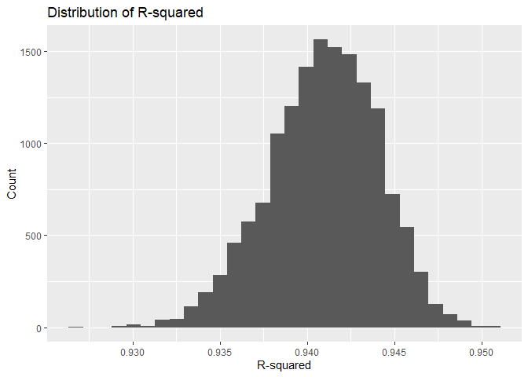
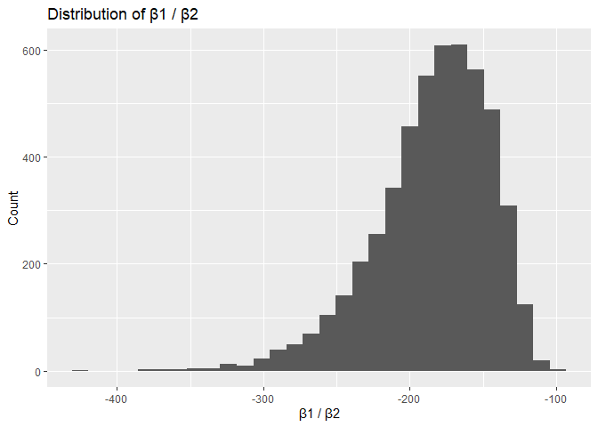

Data Science I Homework 6
================
Ruicheng Yang

``` r
library(tidyverse)
```

    ## ── Attaching core tidyverse packages ──────────────────────── tidyverse 2.0.0 ──
    ## ✔ dplyr     1.1.4     ✔ readr     2.1.5
    ## ✔ forcats   1.0.1     ✔ stringr   1.5.2
    ## ✔ ggplot2   4.0.0     ✔ tibble    3.3.0
    ## ✔ lubridate 1.9.4     ✔ tidyr     1.3.1
    ## ✔ purrr     1.1.0     
    ## ── Conflicts ────────────────────────────────────────── tidyverse_conflicts() ──
    ## ✖ dplyr::filter() masks stats::filter()
    ## ✖ dplyr::lag()    masks stats::lag()
    ## ℹ Use the conflicted package (<http://conflicted.r-lib.org/>) to force all conflicts to become errors

``` r
library(p8105.datasets)
library(broom)
library(modelr)
```

    ## 
    ## Attaching package: 'modelr'
    ## 
    ## The following object is masked from 'package:broom':
    ## 
    ##     bootstrap

``` r
library(mgcv)
```

    ## Loading required package: nlme
    ## 
    ## Attaching package: 'nlme'
    ## 
    ## The following object is masked from 'package:dplyr':
    ## 
    ##     collapse
    ## 
    ## This is mgcv 1.9-3. For overview type 'help("mgcv-package")'.

``` r
library(ggpubr)
```

    ## Warning: package 'ggpubr' was built under R version 4.5.2

# Question 1

``` r
#Read the data of homicide#

homicide_data <- read_csv("https://raw.githubusercontent.com/washingtonpost/data-homicides/refs/heads/master/homicide-data.csv") 
```

    ## Rows: 52179 Columns: 12
    ## ── Column specification ────────────────────────────────────────────────────────
    ## Delimiter: ","
    ## chr (9): uid, victim_last, victim_first, victim_race, victim_age, victim_sex...
    ## dbl (3): reported_date, lat, lon
    ## 
    ## ℹ Use `spec()` to retrieve the full column specification for this data.
    ## ℹ Specify the column types or set `show_col_types = FALSE` to quiet this message.

``` r
#clean data#

homicide_data <- homicide_data |>
  mutate( city_state = paste(city, state, sep = ", "),
    solved = if_else(disposition == "Closed by arrest", 1, 0),
    victim_age = as.numeric(victim_age)
  )
```

    ## Warning: There was 1 warning in `mutate()`.
    ## ℹ In argument: `victim_age = as.numeric(victim_age)`.
    ## Caused by warning:
    ## ! NAs introduced by coercion

``` r
homicide_data_clean <- homicide_data |>
  filter(!(city_state == "Dallas, TX" | city_state == "Phoenix, AZ" | city_state == "Kansas City, MO" |
             city_state == "Tulsa, AL")) |>
  filter(victim_race == "White" | victim_race == "Black")

#view the data of homicides by baltimore#

baltimore_df <- homicide_data_clean |>
  filter(city_state == "Baltimore, MD")

#regression of data#

baltimore_fit <- glm(
  solved ~ victim_age + victim_sex + victim_race, data = baltimore_df,
  family = binomial
)

#baltimore odds ratio by sex#

baltimore_tidy <- broom::tidy(baltimore_fit, conf.int = TRUE, exp = TRUE)

baltimore_OR_male <- baltimore_tidy |>
  filter(term == "victim_sexMale") |>
  select(term, estimate, conf.low, conf.high)

baltimore_OR_male
```

    ## # A tibble: 1 × 4
    ##   term           estimate conf.low conf.high
    ##   <chr>             <dbl>    <dbl>     <dbl>
    ## 1 victim_sexMale    0.426    0.324     0.558

``` r
#extract odds ratio by city and state#

city_results <- homicide_data_clean |>
  nest(data = -city_state) |>
  mutate(fit = map(data, ~ glm(
      solved ~ victim_age + victim_sex + victim_race,
      data = .x, family = binomial
    )),
    tidy = map(fit, ~ broom::tidy(.x, conf.int = TRUE, exp = TRUE))
  ) |> unnest(tidy) |>
  filter(term == "victim_sexMale") |>
  select(city_state, estimate, conf.low, conf.high)
```

    ## Warning: There were 43 warnings in `mutate()`.
    ## The first warning was:
    ## ℹ In argument: `tidy = map(fit, ~broom::tidy(.x, conf.int = TRUE, exp =
    ##   TRUE))`.
    ## Caused by warning:
    ## ! glm.fit: fitted probabilities numerically 0 or 1 occurred
    ## ℹ Run `dplyr::last_dplyr_warnings()` to see the 42 remaining warnings.

``` r
ggplot(city_results,
       aes(x = estimate, y = city_state)) +
  geom_point() +
  geom_errorbarh(aes(xmin = conf.low, xmax = conf.high), height = 0.1) +
  geom_vline(xintercept = 1, linetype = "dashed", color = "orange") +
  labs(title = "Adjusted Odds Ratio of Solved Homicides vs City and State",
       x = "Adjusted Odds Ratio",
       y = "City and State")
```

    ## Warning: `geom_errobarh()` was deprecated in ggplot2 4.0.0.
    ## ℹ Please use the `orientation` argument of `geom_errorbar()` instead.
    ## This warning is displayed once every 8 hours.
    ## Call `lifecycle::last_lifecycle_warnings()` to see where this warning was
    ## generated.

    ## `height` was translated to `width`.

<!-- -->

For the city of Baltimore, Maryland, the odds ratio of solving homicides
for victims of male sex ranges from 0.324 to 0.558 with 95 percent
confidence compared to victims of female sex. This suggests that male
victims’ homicide cases are less likely to be solved compared to female
victims.

This also seems to hold true for many other cities across the United
States. Cities like Chicago and New York have confidence intervals not
including an odds ratio of 1. However, cities like Albuquerque, New
Mexico have a confidence interval that cover odds ratios much higher
than 1, suggesting the possibility that solving homicides for male
victims is higher than female victims.

# Question 2

``` r
#load dataset and reproducibility#

data("weather_df")
set.seed(1)

ideal_model <- tmax ~ tmin + prcp

#boot sample function#

boot_sample = function(df) {
  sample_frac(df, replace = TRUE)
}

#boot strap proedure#

boot_straps <-
  tibble(b = 1:5000) |>
  mutate(
    boot_sample = map(b, \(i) boot_sample(df = weather_df))
  )

bootstrap_results <- boot_straps |> 
  mutate(
    models = map(boot_sample, \(df) lm(ideal_model, data = df) ),
    r2 = map(models, ~ summary(.x)$r.squared),
    results = map(models, broom::tidy)) |> 
  select(-boot_sample, -models) |> 
  unnest(results)

#bootstrap results for estimate#

bootstrap_results_2 <- bootstrap_results |> group_by(b) |> 
  summarize(ratio = estimate[term == "tmin"]/estimate[term == "prcp"])

#summary of results#

bootstrap_results |>
  ggplot(aes(x = as.numeric(r2))) +
  geom_histogram() +
  labs(title = "Distribution of R-squared",
       x = "R-squared",
       y = "Count")
```

    ## `stat_bin()` using `bins = 30`. Pick better value `binwidth`.

<!-- -->

``` r
bootstrap_results_2 |>
  ggplot(aes(x = ratio)) +
  geom_histogram() +
  labs(title = "Distribution of β1 / β2",
       x = "β1 / β2",
       y = "Count")
```

    ## `stat_bin()` using `bins = 30`. Pick better value `binwidth`.

<!-- -->

``` r
bootstrap_results |>
  summarize(
    ci_lower = quantile(as.numeric(r2), 0.025), 
    ci_upper = quantile(as.numeric(r2), 0.975))
```

    ## # A tibble: 1 × 2
    ##   ci_lower ci_upper
    ##      <dbl>    <dbl>
    ## 1    0.934    0.947

``` r
bootstrap_results_2 |> summarize(
  ci_lower = quantile(ratio, 0.025), 
  ci_upper = quantile(ratio, 0.975))
```

    ## # A tibble: 1 × 2
    ##   ci_lower ci_upper
    ##      <dbl>    <dbl>
    ## 1    -280.    -126.

The distribution of both our parameter ratios and R-squared values of
our distributions are approximately normal. For our model, the true
R-squared values ranges from 0.934 to 0.947 at 95 percent confidence,
suggesting a good fit. We are also 95 percent confident the true value
of the ratio of the two parameters lies between -249.7 to -125.7.

# Question 3

``` r
#load data set#

data_birthweight <- read.csv("birthweight.csv")

#clean data set#

data_birthweight_clean <- data_birthweight |>
  mutate(
    babysex = factor(babysex, levels = c(1, 2), labels = c("male", "female")),
    frace   = factor(frace, levels = c(1, 2, 3, 4, 8, 9), labels = c("White", "Black", 
                    "Asian", "Puerto Rican", "Other", "Unknown")),
    mrace   = factor(mrace, levels = c(1, 2, 3, 4, 8), labels = c("White", "Black", 
                    "Asian", "Puerto Rican", "Other")),
    malform = factor(malform, levels = c(0, 1), labels = c("absent", "present"))
  )

#hypothetical model building#

model_lm <- lm(
  bwt ~  babysex + mheight + ppbmi + ppwt + wtgain + frace +
    mrace + malform + fincome + smoken,
  data = data_birthweight_clean
)

birthweight_residuals <- data_birthweight_clean |>
  add_predictions(model_lm) |>
  add_residuals(model_lm)

ggplot(birthweight_residuals, aes(x = pred, y = resid)) +
  geom_point(alpha = 0.4) +
  labs(x = "Fitted Values", y = "Residuals",
       title = "Residuals vs Fitted: Proposed Model")
```

<!-- -->

``` r
set.seed(1)

#cross validation test#

cv_df =
  crossv_mc(data_birthweight_clean, 100) |> 
  mutate(
    train = map(train, as_tibble),
    test = map(test, as_tibble))

cv_df = 
  cv_df |> mutate(
    fit_hypothesis = map(train, \(df) lm(bwt ~ babysex + mheight + ppbmi + ppwt + wtgain + frace +
                                 mrace + malform + fincome + smoken,
                               data = df)),
    fit_A    = map(train, \(df)lm(bwt ~ blength + gaweeks, data = df)),
    fit_B    = map(train, \(df)lm(bwt ~ bhead * blength * babysex, data = df))
  )|> mutate(
    rmse_hypothesis = map2_dbl(fit_hypothesis, test, \(mod, df) rmse(model = mod, data = df)),
    rmse_A    = map2_dbl(fit_A, test, \(mod, df) rmse(model = mod, data = df)),
    rmse_B = map2_dbl(fit_B, test, \(mod, df) rmse(model = mod, data = df)))

cv_df |> 
  select(starts_with("rmse")) |> 
  pivot_longer(
    everything(),names_to = "model", 
    values_to = "rmse",
    names_prefix = "rmse_") |> 
  mutate(model = fct_inorder(model)) |> 
  ggplot(aes(x = model, y = rmse, fill = model)) + geom_violin()
```

<!-- -->

For my hypothetical model, I wanted to focus on variables that were
independent of the baby’s statistics after birth. Thus, I looked at the
possible factors and narrowed down on the attributes of the baby’s
parents. Specifically, this includes mother’s pre-pregnancy BMI and
weight, mother’s height, weight gain, father’s race, mother’s race, the
family’s income, and the avergae number of cigarettes smoken during
pregnancy.

The only factors of the baby that I factored into the model were the
baby’s sex and whether there was a malformation or not.

When plotting the residuals vs the fitted values, we see that there is
not a clear association between the two. For the most part, the
residuals are concentrated around 0 for most fitted values. This
suggests the hypothetical model is at least sufficient for predicting
baby birth weight.

By using cross validation and analyzing the distribution of our root
mean square error (RMSE) for each model, my hypothetical model had the
highest average RMSE. Meanwhile, the model that takes into account
baby’s head circumference at birth, the sex of the baby, the baby’s
length at birth, and the interaction between these variables has the
lowest distribution of RMSE. Thus, that model seems to be the best fit
to predict the birth weight of a baby.
